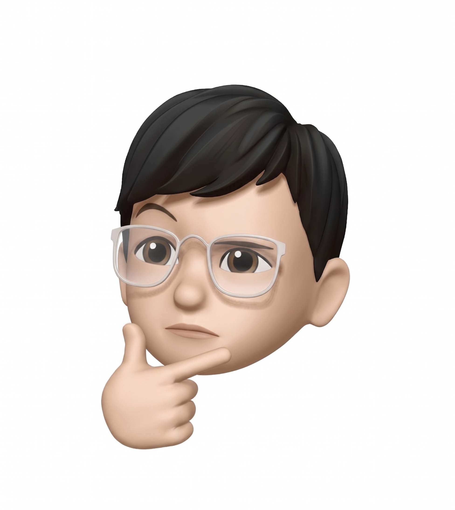

  
  <h1>🌟 Leo Yang – Personal Portfolio</h1>
  
<strong>Software Engineering & Business Undergrad @ Ivey School of Business</strong>

  
🔗 <strong><a href="https://leoyang.me">leoyang.me</a></strong>

 

Welcome to my personal portfolio repository! Designed from scratch with a heavy focus on fluid UI/UX, premium glassmorphism aesthetics, and interactivity, it serves as a central hub to showcase my experience, projects, and personal interests.

## ✨ Features

- **Dynamic Interactive Web Piano 🎹**: A fully functional, playable web piano built with `Tone.js`. It features an integrated MIDI playback system that parses and plays a custom 1300-note array, complete with simulated sustain pedals and an aesthetic glassmorphic interface.

## 🛠️ Tech Stack

- **HTML5 & CSS3**
- **Tailwind CSS** – Extensively utilized for rapid styling and creating the deep, vibrant glassmorphic dark theme.
- **Vanilla JavaScript** – Powers all the scroll physics, particle physics, and UI interactions without the overhead of heavy frameworks.
- **Tone.js** – A Web Audio framework used to synthesize and play the Salamander Grand Piano samples with high-quality reverb nodes.

### Credits
*Icons made from [svg icons](https://www.onlinewebfonts.com/icon) is licensed by CC BY 4.0.*
